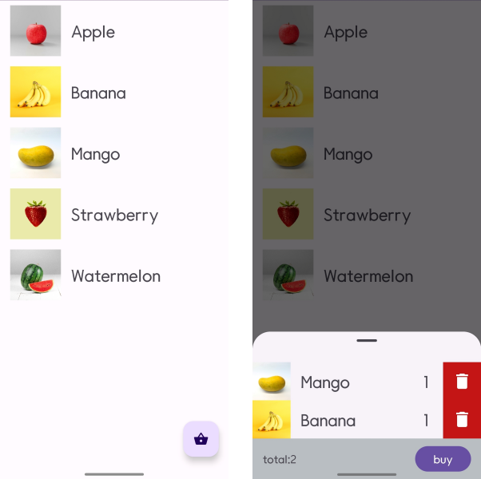
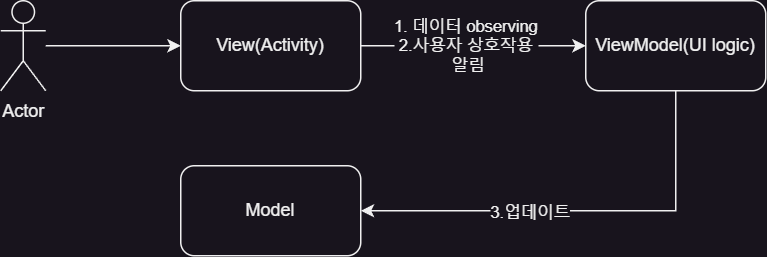

# Android MVC, MVP, MVVM architecture pattern sample

a simple market simulator illustrating the use of MVC, MVP, and MVVM architectures, 
each implemented in its own respective branches.

* click item -> add to basket
* remove basket item
* buy -> clear basket

blog: https://wonhaeseong.github.io/posts/MVC-MVP-MVVP-Study/

# MVVM

